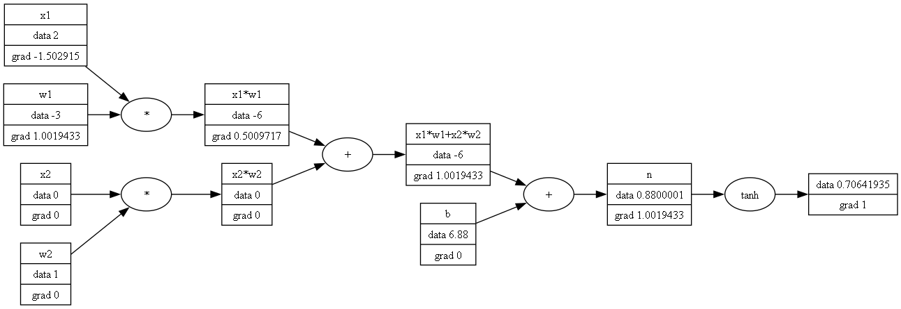

# tiny-autograd

An autograd engine calculates the partial derivite of each term with respect to the output one. To achieve this, it creates an in-memory graph of all the operations that lead up to the result. Each operation has an associated "backward" pass, which computes the gradient of the function. The main structure that makes this possible is the `Value` class, which wraps a floating point value and overloads the operators, while also defining common math operations, with their respective `backward` function.



This visualization is done using the `graphviz` tool!

Backpropagation works by first building a topological sorted set of the nodes, and then running the backward pass on each node. This will fill in the gradient for each node. Now, in a deep learning process, this can be applied on a loss function. A `step size` variable can be defined to be multiplied with the respective gradient of each node within a single learning step.

## Example

```cpp
TinyAutograd::Value a = 2.0f;
TinyAutograd::Value b = 3.0f;

auto c = a * b;
c.Backward();

std::cout << c << ' ' << a.Gradient << '\n';
// 6.0 and 3.0

TinyAutograd::Visualize(c);
// draws the operations graph in ./res/viz.png
```

## Resources

Resources I used to learn this:
 - Andrej Karpathy's lessons from YouTube: https://github.com/karpathy/micrograd
 - PyTorch's documentation: https://pytorch.org/docs/stable/notes/autograd.html
 - Stanford's C231N free lessons: https://cs231n.github.io/

This project is for learning purposes only, it's not intended to be used as a library.

## License

Licensed under GPLv3.
Copyright 2023 Asandei Stefan-Alexandru. All rights reserved.